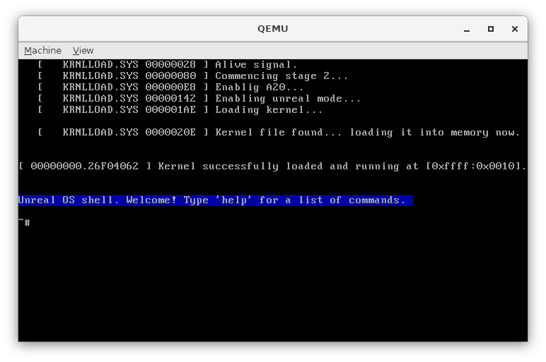

# Unreal OS
> Unreal OS™ created by Jacob Lagares Pozo in unreal mode.
[!alt text](https://img.shields.io/github/search/unrealorg/Unreal-Kernel/jmp.svg "Jmp counter")

#### Warning
Lots of code are taken from https://github.com/Druaga1/DankOS/
Huge thanks and credit to the Echidna Development Team (today, the people who *worked* on Dank OS).
My goal wasn't to copy them in nontheless, but a lot of the code
here (even the style of the OS itself) is really similar to it.
Anyways, i hope more stuff will be comming soon™, like file and memory managements etc.

#### To build
Just use the already created ``build.sh`` script if you have all dependencies installed
(check dependencies), you should be able to build it just executing it.
You can always, of course, build it manually (not recommended if it is the first time you are
trying it out.)

#### Dependencies
* ``nasm``, the assembly compiler. https://nasm.us/
* ``Python`` Version must be 3.6+. https://www.python.org/
* ``Linux`` (check next section)

#### Why need of linux?
You need linux to build, because of the commands that it uses in the build script.
However, it is not 100% necessary to have a linux installation in your machine,
as you can use some terminals that already have this tools (like git terminal),
or even better,  you can just install the linux subsystem for windows.

#### Failed build
Build script is incredibly simple, same as dependencies, so you should be able to
build wihtout problems. In case you have, check the dependencies. In case it is
still failing, even if you know everything is 100% ok, open an issue in this
repository, and I might be able to help you.

#### Successfull build
What's next?
You can test it with QEMU (or any vm really(QEMU comes by default in the build script)).
Just make sure that you boot as floppy, as the format is flat binary for now,
and VMs shouldn't be able to support it running as a HDD or DVD...

You should get something like this in a successfull build, when testing it:

#### Other stuff i used (to learn basically)
* https://github.com/mig-hub/MikeOS
* https://github.com/cfenollosa/os-tutorial
* https://littleosbook.github.io/

#### External links and misc
* https://wiki.osdev.org/Expanded_Main_Page
* https://wiki.osdev.org/Unreal_Mode
* https://wiki.osdev.org/Protected_Mode
* https://en.wikipedia.org/wiki/Real_mode
* https://en.wikipedia.org/wiki/INT_10H
* https://en.wikipedia.org/wiki/INT_13H
* https://es.wikipedia.org/wiki/Int_15h
* http://ref.x86asm.net/coder32.html
